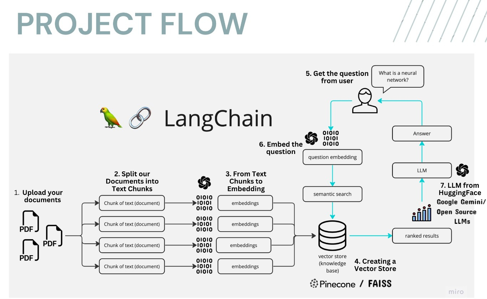

# **📚 AskMyPDF - AI Chatbot 🤖**  

### **Chat Seamlessly with Multiple PDFs!**  
Transform how you interact with PDFs using **Langchain**, **Google Gemini Pro**, and **FAISS Vector DB**!  
Upload multiple PDFs, extract insights, and chat with them in real-time. 🚀✨  

🔗 **[Try the Demo on Streamlit!](https://askmypdf1.streamlit.app/)**  

---

## **📝 About AskMyPDF**  

AskMyPDF is a **Streamlit-powered AI chatbot** that lets you upload multiple PDF files and engage in conversations with their content.  
Using **advanced AI models**, it extracts, processes, and understands PDF data, providing **instant and accurate responses** to your questions.  

---

## **🎯 How It Works**  

### **📌 Step-by-Step Process**
1️⃣ **Upload PDFs** – Drag and drop multiple PDF files into the app.  
2️⃣ **Text Extraction** – The app extracts text from all uploaded files.  
3️⃣ **Text Chunking** – Documents are divided into meaningful, searchable chunks.  
4️⃣ **AI Processing** – Google's **Gemini Pro** generates vector embeddings.  
5️⃣ **Similarity Search** – The app finds the most relevant text chunks.  
6️⃣ **Response Generation** – AI formulates an intelligent response to your query!  

🖼️ **Architecture Overview:**  
  

---

## **🚀 Key Features**  

✅ **Multi-Document Conversational AI** – Chat with multiple PDFs at once.  
✅ **Supports PDF & TXT Files** – Upload and process documents easily.  
✅ **Smart Adaptive Chunking** – Dynamic text segmentation for improved accuracy.  
✅ **Powered by AI** – Uses **Google Gemini Pro**, **OpenAI GPT-3**, **Anthropic Claude**, and **Llama2**.  
✅ **Instant Answers** – AI retrieves context-based answers from your PDFs.  
✅ **Easy-to-Use Interface** – A clean and responsive UI powered by **Streamlit**.  

📌 **Example AI Output:**  
  

---

## **🔧 Installation & Setup**  

### **1️⃣ Clone the Repository**  
```sh
git clone https://github.com/YOUR_GITHUB_USERNAME/AskMyPDF.git
cd AskMyPDF
```

### **2️⃣ Install Required Dependencies**  
```sh
pip install -r requirements.txt
```

### **3️⃣ Set Up API Key**  
Get a Google API key from [Google MakerSuite](https://makersuite.google.com/app/apikey).  
Create a `.env` file in the root directory and add:  
```
GOOGLE_API_KEY=<your-api-key-here>
```

### **4️⃣ Run the Application**  
```sh
streamlit run app.py
```

---

## **💡 How to Use**  

1️⃣ **Launch the App** – Run `streamlit run app.py` to start the chatbot.  
2️⃣ **Upload PDFs** – Drag and drop multiple PDF files into the sidebar.  
3️⃣ **Process Files** – Click **"Process Documents"** to extract and prepare data.  
4️⃣ **Ask Questions** – Type your queries in the chatbox and get AI-powered responses.  
5️⃣ **Enjoy AI-Powered Insights!** 🚀  

🖼️ **Example Conversation:**  
  

---

## **📌 Requirements**  

| 📦 Dependency | 🔹 Purpose |
|--------------|-----------|
| **Streamlit** | Web UI framework |
| **Google Generative AI** | AI-powered responses |
| **Langchain** | Conversational AI processing |
| **FAISS** | Vector search for document retrieval |
| **PyPDF2** | Extract text from PDF files |
| **python-dotenv** | Manage API keys securely |

---

## **🎯 Demo & Deployment**  

Want to try AskMyPDF without setup? 🚀  

🔗 **[Try the Live App on Streamlit!](https://askmypdf1.streamlit.app/)**  

---

## **🛠️ Future Enhancements**  

🔹 Support for **DOCX & PPTX** files 📄  
🔹 Integration with **Voice Assistants** 🎙️  
🔹 Advanced **Summarization & Report Generation** 📊  

---

## **📜 License**  
This project is licensed under the **MIT License**. See `LICENSE` for details.  

---

## **🚀 Connect with Me!**  

📌 **If you find this project useful, drop a ⭐ on GitHub!**  

[](https://github.com/yashkusumkar02/)  
[](https://www.linkedin.com/in/suyash-kusumkar/)  

---

### **🔥 Ready to Chat with Your PDFs? Try AskMyPDF Now!** 🚀  

Let me know if you'd like any further customization! 😊
